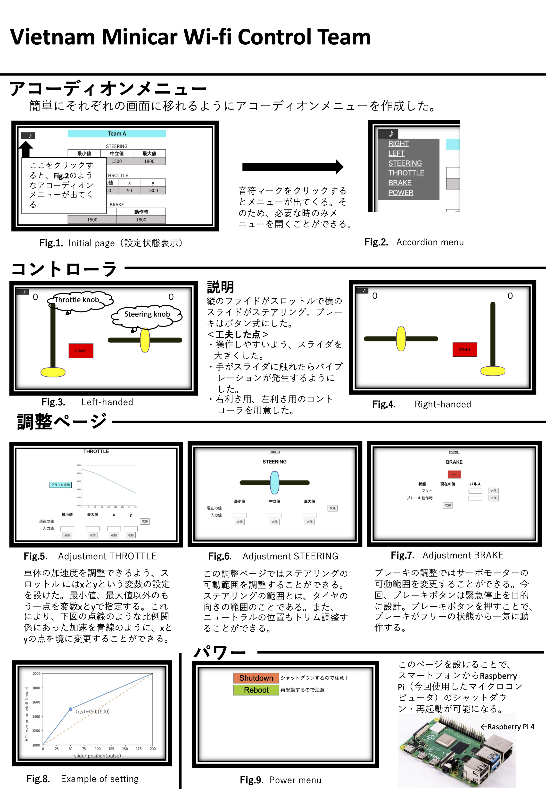

# ラジコンカー制御アプリ

エンジン搭載ラジコンカーの制御アプリです。車体には Raspberry Pi を搭載していて、Wifi 経由でスマホから司令を送ります。車体上の Raspberry Pi でサーボモータを制御します。
スマホと Raspberry Pi の通信には、[WebIOPi](http://webiopi.trouch.com/)というライブラリを使用しています。

# 開発記事

[WebIOPi のインストール](https://qiita.com/happanosumide/items/2b151e2250953de3a258)
[【WebIOPi】スマホでサーボモーターを制御！](https://qiita.com/happanosumide/items/7d8bf4b2d537188d9929)

# public

[ベトナム・ミニカーレーシングのお披露目会を実施](https://www.ariake-nct.ac.jp/event-info/2020/10/14269.html)
